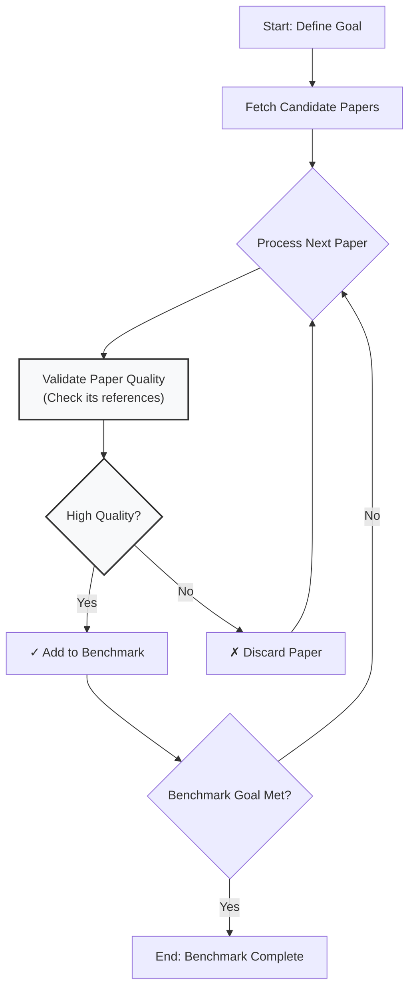
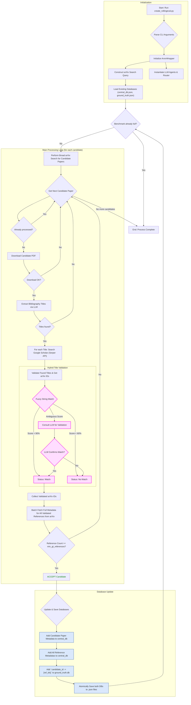

# Multi-Agent Paper Review & Analysis Toolkit

This project provides a sophisticated, multi-agent system for performing deep analysis of academic papers. It leverages a pipeline of specialized AI agents to conduct literature discovery, generate multi-faceted reviews, and synthesize a final meta-review.

The system is designed to be modular and extensible, allowing for the easy addition of new agents, review strategies, and behavioral modes.

## Features

-   **End-to-End Pipeline:** A single command can trigger the entire workflow:
    1.  **Related Paper Summarization:** Optional summarization of related papers to provide context for novelty checks.
    2.  **Reviewer Gauntlet:** Runs a suite of reviewer agents (composite/monolithic strategies) in parallel to generate diverse perspectives.
    3.  **Metareviewer:** Analyzes all generated reviews, performs fact-checking against the original paper, and produces a final, synthesized meta-review.
-   **Configurable Agents:** Control the behavior of reviewers with different "strategies" (e.g., `composite`, `monolithic`) and "modes" (e.g., `default`, `critical`, `permissive`).
-   **Robust Caching:** Caches API results and downloaded papers to significantly speed up subsequent runs and reduce costs.
-   **Modular Architecture:** Built with a clean separation of concerns, making it easy to maintain and extend.

---

## Directory Structure

The project follows a standard Python package structure, separating application logic (`src`) from the main driver script.

```
META_AND_REVIEWER_TOOLS/
├── .cache/                     # Caches downloaded PDFs and API results  
├── .gitignore                  # Git ignore file
├── LICENSE                     # Apache 2.0 License
├── README.md                   # This file
├── main.py                     # The main driver script to run the full pipeline
├── benchmark.py                     # The main driver script to run the full benchmarking suite
├── requirements.txt            # Project dependencies
├── litllm_results/             # Outputs from the LitLLM agent pipeline
├── papers/                     # Input PDF files for analysis
├── reviews/                    # Outputs from the Reviewer and Metareviewer pipeline
├── metareviews/                    # Outputs from the Reviewer and Metareviewer pipeline
├── rebuttals/                    # Outputs from the Reviewer and Metareviewer pipeline
├── benchmark_data/             # Benchmark cases for agent evaluation
└── src/                        # Source code package
    ├── __init__.py
    ├── agents/                 # Core location for all agent logic
    │   ├── __init__.py
    │   ├── litllm/
    │   │   ├── __init__.py
    │   │   ├── agent.py
    │   │   ├── components/
    │   │   │   ├── __init__.py
    │   │   │   ├── debate_ranking_agent.py
    │   │   │   └── keyword_extraction_agent.py
    │   │   └── types/
    │   │       └── composite.py
    │   ├── metareviewer/
    │   │   ├── __init__.py
    │   │   ├── components/
    │   │   │   ├── __init__.py
    │   │   │   ├── fact_extraction_agent.py
    │   │   │   ├── fact_verification_agent.py
    │   │   │   ├── fact_significance_agent.py
    │   │   │   ├── final_synthesis_agent.py
    │   │   │   ├── initial_stance_agent.py
    │   │   │   ├── key_points_agent.py
    │   │   │   └── rebuttal_analysis_agent.py
    │   │   └── types/
    │   │       └── composite.py
    │   ├── reviewer/
    │   │   ├── __init__.py
    │   │   ├── components/
    │   │   │   ├── __init__.py
    │   │   │   ├── base_check_agent.py
    │   │   │   ├── experiment_check_agent.py
    │   │   │   ├── impact_check_agent.py
    │   │   │   ├── novelty_check_agent.py
    │   │   │   ├── organization_check_agent.py
    │   │   │   ├── paper_summary_agent.py
    │   │   │   ├── results_discussion_check_agent.py
    │   │   │   └── soundness_check_agent.py
    │   │   └── types/
    │   │       ├── __init__.py
    │   │       ├── base.py
    │   │       ├── composite.py
    │   │       └── monolithic.py
    │   ├── evaluator/
    │   │   ├── __init__.py
    │   │   ├── components/
    │   │   │   ├── __init__.py
    │   │   │   ├── comparison_agent.py
    │   │   │   └── grading_agent.py
    │   │   └── types/
    │   │       ├── __init__.py
    │   │       └── composite.py
    │   └── author/
    │       ├── __init__.py
    │       ├── components/
    │       │   ├── __init__.py
    │       │   └── rebuttal_agent.py
    │       └── types/
    │           └── composite.py
    ├── prompts/
    │   ├── __init__.py
    │   ├── structures.py
    │   ├── litllm/
    │   │   └── default.py
    │   ├── metareviewer/
    │   │   ├── __init__.py
    │   │   └── default.py
    │   ├── reviewer/
    │   │   ├── __init__.py
    │   │   ├── critical.py
    │   │   ├── default.py
    │   │   └── permissive.py
    │   ├── evaluator/
    │   │   ├── __init__.py
    │   │   ├── default.py
    │   └── author/
    │       ├── __init__.py
    │       └── default.py
    ├── services/
    │   ├── __init__.py
    │   ├── base_llm_service.py
    │   ├── llm_service_router.py
    │   ├── openai_like_service.py
    │   ├── paper_fetcher_service.py
    │   └── prompt_service.py
    └── utils/
        ├── __init__.py
        ├── file_utils.py
        └── paper_utils.py
```

---

## Setup

1.  **Clone the repository:**
    ```bash
    git clone <your-repo-url>
    cd META_AND_REVIEWER_TOOLS
    ```

2.  **Create and activate a virtual environment** (recommended):
    ```bash
    python -m venv venv
    source venv/bin/activate  # On Windows, use `venv\Scripts\activate`
    ```

3.  **Install dependencies:**
    ```bash
    pip install -r requirements.txt
    ```

4.  **Set up environment variables:**
    -   Create a `.env` file in the project root.
    -   Add your API keys (e.g., `OPENAI_API_KEY`, `OPENROUTER_API_KEY`, `GEMINI_API_KEY`).
    -   Optionally provide `OLLAMA_BASE_URL` for local models.
    -   Example `.env` file:
        ```
        OPENAI_API_KEY=your_openai_api_key_here
        OPENROUTER_API_KEY=your_openrouter_api_key_here
        GEMINI_API_KEY=your_gemini_api_key_here
        OLLAMA_BASE_URL=http://localhost:11434/v1
        VLLM_BASE_URL=http://localhost:8085/v1
        ```

---

## Usage

The primary entry point is `main.py`, which orchestrates the full end-to-end pipeline. All commands should be run from the project's root directory.

### Basic Usage

To run the complete pipeline (LitLLM -> 6 Reviewers -> Metareviewer) on a paper using default settings:

```bash
python main.py path/to/your/paper.pdf
```

### Advanced Usage & Options

You can customize the run with various command-line flags:

-   **Specify Models:** Use different models for the initial reviews and the final metareview.
    ```bash
    python main.py path/to/paper.pdf --reviewer_model gemini-2.0-flash-lite --metareviewer_model gpt-4-turbo
    ```

-   **Provide Related Papers:** Include a directory of related papers for context.
    ```bash
    python main.py path/to/paper.pdf --closest_papers_dir path/to/related/papers/
    ```

-   **Skip Metareview:** Run only the reviewers without the final metareview.
    ```bash
    python main.py path/to/paper.pdf --skip_metareview
    ```

-   **Force Rerun:** Bypass the reviewer cache and force all reviewers to run again.
    ```bash
    python main.py path/to/paper.pdf --force_rerun_reviewers
    ```

-   **Provide Email:** Use your email for polite access to academic APIs like OpenAlex.
    ```bash
    python main.py path/to/paper.pdf --email your.name@example.com
    ```
---

## Benchmarking

To rigorously evaluate the performance of the AI agents, this project supports a benchmark format that models the true conversational and event-driven nature of academic peer review. This allows for a granular assessment of each agent's capabilities, from initial review generation to understanding rebuttals and final synthesis.

### Benchmark Data Structure

A benchmark case is a directory containing the paper and a `review_process_log.jsonl` file, which logs the entire human-driven review process.

```
benchmark_data/
└── my_benchmark_paper/
    ├── paper.pdf
    └── review_process_log.jsonl
```

The `review_process_log.jsonl` is a JSON Lines file where each line is a JSON object representing one event. This structure creates a "conversation graph" that the benchmark driver can replay to test the AI agents at each step.

### Event Log Schema

Each event in the log follows a standard schema:

*   `event_id`: A unique string identifier for the event (e.g., `evt_001`).
*   `reply_to_event_id`: The `event_id` this event is a reply to. `null` for root events. This links events into conversation threads.
*   `timestamp`: An ISO 8601 timestamp string for chronological ordering.
*   `author_role`: The role of the person creating the event (e.g., `author`, `reviewer_1`, `metareviewer`).
*   `event_type`: A specific string identifying the nature of the event (see table below).
*   `content`: The textual or structured JSON content of the event.

**Example `review_process_log.jsonl` entry:**
```json
{"event_id": "evt_002", "reply_to_event_id": "evt_001", "timestamp": "2023-10-15T11:20:00Z", "author_role": "reviewer_1", "event_type": "review", "content": "Strengths: The proposed architecture is novel. Weaknesses: The experimental validation is weak..."}
{"event_id": "evt_003", "reply_to_event_id": "evt_002", "timestamp": "2023-10-20T09:00:00Z", "author_role": "author", "event_type": "rebuttal", "content": "Thank you for the feedback. We have added a new experiment to address the validation concern."}
```

### Event Type Vocabulary

The `event_type` key is crucial for signaling which agent or capability to test. The standard vocabulary includes:

| event_type             | Description                                                                          |
| ---------------------- | ------------------------------------------------------------------------------------ |
| `submission`           | The initial submission of the manuscript. The root of the process.                   |
| `review`               | A formal critique and recommendation from a reviewer.                                |
| `rebuttal`             | The author's formal response to one or more reviews.                                 |
| `decision`             | The final, terminal judgment on the paper (e.g., Accept, Reject).                    |
| `comment`              | A general-purpose message for discussion between any participants.                   |
| `request_for_clarification` | A targeted question asking for more detail on a specific point.                      |
| `recommendation_update` | A formal change in a reviewer's recommendation, often post-rebuttal.                 |
| `withdrawal`           | The author's decision to withdraw the paper from consideration.                      |

For critical events like `decision` and `recommendation_update`, the `content` field should contain a structured JSON object to allow for precise, quantitative evaluation.

---

## How to Add a New Agent

This system is designed for easy extension. Let's say you want to add a new top-level agent called **`QualityChecker`** that assesses the linguistic quality of a paper.

#### Step 1: Create the Agent's Directory Structure

Create new folders for your agent's logic and prompts.

```
src/
└── agents/
    ├── quality_checker/        # <-- NEW
    │   ├── components/         # For sub-agents like GrammarCheck, StyleCheck
    │   └── types/              # For the main orchestrator (e.g., CompositeQualityChecker)
    └── ...
└── prompts/
    ├── quality_checker/        # <-- NEW
    │   └── default.py          # Prompts for the new agent
    └── ...
```

#### Step 2: Define Prompts and Structures

1.  **Define the Schema (in `src/prompts/structures.py`):**
    Create a new dataclass for your agent's prompts.

    ```python
    @dataclass(frozen=True)
    class QualityCheckerPrompts:
        grammar: PromptPair
        style: PromptPair
    ```

2.  **Create the Prompt Module (in `src/prompts/quality_checker/default.py`):**
    Create the actual prompt object using the new dataclass.

    ```python
    from src.prompts.structures import PromptPair, QualityCheckerPrompts

    QUALITY_CHECKER_PROMPTS = QualityCheckerPrompts(
        grammar=PromptPair(system="You are a grammar checker...", user="..."),
        style=PromptPair(system="You are a style checker...", user="...")
    )
    ```

#### Step 3: Create the Agent and its Components

1.  **Create Component Shells (in `src/agents/quality_checker/components/`):**
    Create simple classes that inherit from `BaseCheckAgent`.

    ```python
    # src/agents/quality_checker/components/grammar_agent.py
    from src.agents.reviewer.components.base_check_agent import BaseCheckAgent

    class GrammarAgent(BaseCheckAgent):
        pass
    ```

2.  **Create the Main Orchestrator (in `src/agents/quality_checker/types/`):**
    This class will run the pipeline for your new agent. It will likely inherit from `BaseReviewer` to reuse its `save_review_output` functionality.

    ```python
    # src/agents/quality_checker/types/composite.py
    from src.agents.reviewer.types.base import BaseReviewer
    
    class CompositeQualityChecker(BaseReviewer):
        def __init__(self, prompts: QualityCheckerPrompts, ...):
            # ... initialize self.grammar_agent, self.style_agent ...
        
        async def run(self):
            # ... call self.grammar_agent.execute() ...
            # ... call self.style_agent.execute() ...
            # ... save outputs ...
    ```

#### Step 4: Register the New Agent

The final step is to tell the central factory system that your new agent exists.

1.  **Update the Registry (in `src/services/prompt_service.py`):**
    Add a new entry to the `AGENT_CONFIG` dictionary.

    ```python
    AGENT_CONFIG = {
        "reviewer": { ... },
        "metareviewer": { ... },
        "litllm": { ... },
        # --- ADD YOUR NEW AGENT ---
        "quality_checker": {
            "composite": {
                "class_path": "src.agents.quality_checker.types.composite.CompositeQualityChecker",
                "class_name": "CompositeQualityChecker",
                "prompt_key": "QUALITY_CHECKER_PROMPTS"
            }
        }
    }
    ```

Your new `QualityChecker` agent is now fully integrated! You can create a new driver script for it or add it as another stage in the main pipeline by calling the `get_agent_and_prompts` service with `agent_type="quality_checker"`.

```mermaid
graph TD
    %% --- Define Styles for Different Component Types ---
    classDef script fill:#f9f,stroke:#333,stroke-width:2px;
    classDef service fill:#ccf,stroke:#333,stroke-width:2px;
    classDef agent_orchestrator fill:#9f9,stroke:#333,stroke-width:2px;
    classDef agent_component fill:#d5f5e3,stroke:#27ae60,stroke-width:1px;
    classDef base_class fill:#f2f3f4,stroke:#839192,stroke-width:1px,stroke-dasharray: 5 5;
    classDef data_store fill:#fdebd0,stroke:#e67e22,stroke-width:2px;
    classDef external_api fill:#aed6f1,stroke:#3498db,stroke-width:2px;
    classDef prompts fill:#f5b7b1,stroke:#c0392b,stroke-width:1px;

    %% --- Top Level Execution & External Services ---
    subgraph "High-Level Overview"
        direction LR
        User(fa:fa-user User)
        main_py["main.py<br>(Full Pipeline)"]:::script
        benchmark_py["benchmark.py<br>(Evaluation)"]:::script
        LLM_APIs["fa:fa-robot LLM APIs<br>(OpenAI, Gemini, etc)"]:::external_api
        Academic_APIs["fa:fa-book Academic APIs<br>(ArXiv, OpenAlex)"]:::external_api
        
        User -- "Runs" --> main_py
        User -- "Runs" --> benchmark_py
    end

    %% --- Core Application Logic (`src`) ---
    subgraph "src - Core Application Logic"
        
        %% --- Services Sub-Package ---
        subgraph "src/services"
            direction TB
            PromptService["prompt_service.py<br>(Agent & Prompt Factory)"]:::service
            LLMRouter["llm_service_router.py"]:::service
            PaperFetcher["paper_fetcher_service.py"]:::service
            OpenAILikeService["openai_like_service.py"]:::service
            BaseLLMService["base_llm_service.py"]:::base_class

            LLMRouter --> OpenAILikeService
            OpenAILikeService -- "Inherits" --> BaseLLMService
            OpenAILikeService -->|API Call| LLM_APIs
            PaperFetcher -->|API Call| Academic_APIs
        end

        %% --- Prompts Sub-Package ---
        subgraph "src/prompts"
            direction LR
            PromptStructures["structures.py"]:::prompts
            AllPrompts[".../*.py<br>(reviewer, metareviewer, etc.)"]:::prompts
            PromptService -- "Loads from" --> AllPrompts
        end

        %% --- Agents Sub-Package ---
        subgraph "src/agents"
            direction TB
            
            subgraph "Base Agent Classes"
                direction LR
                BaseReviewer["BaseReviewer"]:::base_class
                BaseCheckAgent["BaseCheckAgent"]:::base_class
            end

            subgraph "Reviewer Agent"
                ReviewerFactory["ReviewerAgent Factory"]:::service
                CompositeReviewer["CompositeReviewer"]:::agent_orchestrator
                ReviewerComponents["...CheckAgent<br>components"]:::agent_component
                
                ReviewerFactory -.->|"Instantiates"| CompositeReviewer
                CompositeReviewer -- "Inherits" --> BaseReviewer
                CompositeReviewer -- "Uses" --> ReviewerComponents
                ReviewerComponents -- "Inherits" --> BaseCheckAgent
            end

            subgraph "LitLLM, Author, Metareviewer, Evaluator Agents"
                LitLLMAgent["CompositeLitLLMAgent"]:::agent_orchestrator
                AuthorAgent["CompositeAuthor"]:::agent_orchestrator
                MetareviewerAgent["CompositeMetareviewer"]:::agent_orchestrator
                EvaluatorAgent["CompositeEvaluatorAgent"]:::agent_orchestrator

                LitLLMAgent -- "Inherits" --> BaseReviewer
                AuthorAgent -- "Inherits" --> BaseReviewer
                MetareviewerAgent -- "Inherits" --> BaseReviewer
                EvaluatorAgent -- "Inherits" --> BaseReviewer
            end

            %% Central agent interaction point
            BaseCheckAgent -- "Executes through" --> LLMRouter
        end
    end

    %% --- Filesystem Data Stores ---
    subgraph "Filesystem I/O"
        direction LR
        PapersDir["papers/"]:::data_store
        ReviewsDir["reviews/"]:::data_store
        MetareviewsDir["metareviews/"]:::data_store
        LitLLMResultsDir["litllm_results/"]:::data_store
        BenchmarkDataDir["benchmark_data/"]:::data_store
    end

    %% --- Define Workflows & Connections ---

    %% Main.py Workflow
    main_py -->|Gets Agent Class| PromptService
    main_py -->|Creates| LitLLMAgent
    LitLLMAgent -->|Uses| PaperFetcher
    LitLLMAgent -->|Reads from| PapersDir
    LitLLMAgent -->|Writes to| LitLLMResultsDir
    main_py -->|Creates| ReviewerFactory
    ReviewerFactory -->|Writes to| ReviewsDir
    main_py -->|Creates| AuthorAgent
    AuthorAgent -->|Reads from| ReviewsDir
    main_py -->|Creates| MetareviewerAgent
    MetareviewerAgent -->|Reads from| ReviewsDir
    MetareviewerAgent -->|Writes to| MetareviewsDir

    %% Benchmark.py Workflow
    benchmark_py -->|Gets Agent Class| PromptService
    benchmark_py -->|Creates| EvaluatorAgent
    benchmark_py -->|Reads Ground Truth| BenchmarkDataDir
    benchmark_py -->|Reads AI Output| ReviewsDir
```



python -u -m vllm.entrypoints.openai.api_server \
  --host 0.0.0.0 \
  --model Qwen/Qwen3-32B \
  --tensor-parallel-size 8 \
  --load-format safetensors \
  --port 8085 \
  --dtype half \
  --gpu-memory-utilization 0.95 \
  --rope-scaling '{"rope_type":"yarn","factor":4.0,"original_max_position_embeddings":32768}' \
  --max-model-len 131000 \
  --enforce-eager \
  --enable-reasoning


vllm serve Qwen/Qwen3-235B-A22B --tensor-parallel-size 8 --gpu-memory-utilization 0.95 --rope-scaling '{"rope_type":"yarn","factor":4.0,"original_max_position_embeddings":32768}' --max-model-len 120000 --reasoning-parser qwen3

VLLM_DISABLE_COMPILE_CACHE=1 vllm serve meta-llama/Llama-4-Maverick-17B-128E-Instruct-FP8 \
  --tensor-parallel-size 8 \
  --max-model-len 430000'


## Flowchart of the RollingEval benchmark creation:



And here's a more detailed version


CUDA_VISIBLE_DEVICES=0,1 vllm serve openai/gpt-oss-120b --reasoning-parser openai_gptoss --max_num_seqs 4096 --max_num_batched_tokens 32768 --gpu_memory_utilization 0.95 --tensor-parallel-size 2

CUDA_VISIBLE_DEVICES=2,3 vllm serve mistralai/Mistral-Small-3.1-24B-Instruct-2503 --tokenizer_mode mistral --config_format mistral --load_format mistral --tensor-parallel-size 2 --port 8002 --gpu_memory_utilization 0.95

CUDA_VISIBLE_DEVICES=4,5,6,7 vllm serve Qwen/Qwen3-235B-A22B-FP8 --rope-scaling '{"rope_type":"yarn","factor":4.0,"original_max_position_embeddings":32768}' --max-model-len 131072 --tensor-parallel 4 --port 8001 --reasoning-parser qwen3 --gpu_memory_utilization 0.95

